# Documentation of the different training runs

This file records every training run of the plume agent on Fox: the settings, what changed from the previous run and why, and the results. Use it to see how a parameter change affects training.

- **Run folders:** `../trained_agents/<run>` on this machine. On Fox the training scripts write to `../trained-agents/<run>`.
- **Run names:** `<ALG>_<tag>_<Slurm job ID>`, set by [fox_train.sh](../fox_train.sh). One `sbatch fox_train.sh <tag>` starts DQN, PPO and SAC as one array job, so all three share the job ID.
- **Copies in git:** [training_runs/](training_runs/) holds `training_stats.png` and `training_config.json` for each run. The SVG plots, the models and the stats pickles stay in `../trained_agents`.
- **Why the methods are set up the way they are:** [comparing_training_methods.md](comparing_training_methods.md).

## How to read the results

The plots come from [training_data_visualiser.py](../HUGIN_gym/evaluation/training_data_visualiser.py). The numbers tables come from [summarise_training_stats.py](../HUGIN_gym/evaluation/summarise_training_stats.py):

```bash
.venv/bin/python -m HUGIN_gym.evaluation.summarise_training_stats ../trained_agents/<run> [<run> ...] --last 1000
```

| Metric | Meaning |
|---|---|
| Total reward | Sum of the rewards in the episode. |
| Episode length | Steps in the episode. The step limit is the run's episode length setting. |
| Visited (%) | Share of the map the agent visited by the end of the episode. |
| Plume coverage (%) | Share of the true above-threshold cells the agent visited by the end of the episode. In the plots this panel is labelled "Steps Above Threshold (%)". |
| Ended early (%) | Share of episodes that ended before the step limit. For the plume agent this only happens when it reaches its plume coverage goal (100 %, +40 reward). With the GP on, the goal is checked against the GP's estimate of the plume, so it can differ from the true coverage. |

- The numbers are mean ± std over the last 1,000 training episodes of a run. For repeated runs, the bold row gives the mean ± std of the run means.
- In GP runs, 1–15 % of the episodes do not report the true plume coverage, so that column covers slightly different episodes than the others.
- Training episodes include exploration (random actions for DQN, sampled actions for PPO and SAC). Use these numbers to see how a change affects one algorithm. Do not use them to rank the algorithms; that needs the deterministic evaluation described in [comparing_training_methods.md](comparing_training_methods.md#3-how-to-compare).
- In the plots, the "Steps Around Threshold (%)" panel is always empty for the plume agent. The rightmost panel shows the reward at each step of every 10th episode; the spikes to 40 are the goal bonus.

## Overview

| # | Tag | Slurm job IDs | Started | Code | Main change | Status |
|---|---|---|---|---|---|---|
| 1 | `gp_230steps` | 4218364 | 2026-09-24 22:01 | `f220184` | First runs of all three algorithms on Fox | Finished |
| 2 | `compare` | 4223550, 4223553, 4223557 | 2026-09-26 13:35–13:49 | `961f7a2` | Same task, budget and network size for all three algorithms; start near the plume; random plume size; less DQN exploration. 3 repeats | Finished |
| 3 | `compare_100M` | 4259604, 4259607, 4259610 | after 2026-10-02 | `d80a55e` | 10× the steps, 24 envs, 460-step episodes, 128 × 128 networks. 3 repeats | Submitted, results pending |

"Started" is `RUN_INFO.timestamp` in `training_config.json`. "Code" is the last commit before the run started.

## Settings shared by all runs

- **Agent:** plume agent (`AGENT_TYPE = "PLUME"`) with the feature extractor `AgentPlumeExplore` ([agent2_plume_explore.py](../HUGIN_gym/agents/feature_extractor/agent2_plume_explore.py)). It turns 108 inputs into 128 features (ReLU): plume and map coverage, position and heading, a 7 × 7 visited patch, a 7 × 7 plume patch, and the distance from the maximum. The hidden layers after it differ per run (see the tables).
- **Observation keys:** DQN and SAC keep 7 keys (`obs_state`, `visited_maps_downsampled`, `GT_c_over_threshold_maps_downsampled`, `local_GT`, `plume_coverage`, `space_coverage`, `distance_from_max`); PPO keeps 5 (without the two downsampled maps). The feature extractor does not read the downsampled maps, so all three get the same inputs.
- **Environment** ([HUGIN_env.py](../HUGIN_gym/envs/HUGIN_env.py)): 2D map of 41 × 41 cells, one Gaussian gas source per episode at a random position, concentration threshold 0.3, 5 discrete actions (forward, up, down, left turn, right turn). SAC acts through [continuous_wrapper.py](../HUGIN_gym/envs/wrappers/continuous_wrapper.py), which maps one number in [−1, 1] to the 5 actions.
- **Goal:** accuracy goals [0.9, 1.0, 1.0], so the plume agent's goal is 100 % plume coverage.
- **Reward** ([agent2_plume.py](../HUGIN_gym/envs/core/rewards/agent2_plume.py), identical in all runs; each `training_config.json` stores the source under `REWARD_FUNCTION_SOURCE`): per step a −0.7 time penalty, + (newly covered above-threshold cells) / 6, and a turn penalty of up to −0.3. Reaching the goal gives +40 and ends the episode.
- **GP** ([GPWrapper.py](../HUGIN_gym/envs/wrappers/GPWrapper.py), RBF kernel, length scale 3.5): with the GP on, the agent's plume patch and plume coverage come from a Gaussian process fitted to its own measurements, and the reward and the goal check use that estimate. With the GP off, the agent sees the true plume.
- **Fox:** module `Python/3.12.3-GCCcore-13.3.0`, one math thread per process, one array task per algorithm.

## Run 1: `gp_230steps` (job 4218364)

- **Goal:** first training of the plume agent with DQN, PPO and SAC on Fox, as a baseline.
- **Submitted with:** `sbatch fox_train.sh gp_230steps`
- **Code:** `f220184` (2026-09-24). PPO used the `--paper` preset (`PAPER_CONFIG`).
- **Fox resources per algorithm:** 16 CPUs, 2 GB per CPU, 16 h limit.

> **The tag is misleading.** Only DQN trained with the GP and 230-step episodes. PPO and SAC trained without the GP and with 460-step episodes, which is a different and easier task. DQN also trained for 3× as many steps. The three algorithms in this run are therefore not comparable.

### Task and budget

| Setting | DQN | PPO | SAC |
|---|---|---|---|
| Script and preset | `train_DDQN.py` | `train_PPO.py --paper` | `train_SAC.py` |
| GP / `SUB_AGENT_TRAIN_ON_GP` | on / on | off / on (no effect without the GP) | off / off |
| Episode length (steps) | 230 | 460 | 460 |
| Total steps | 30M | 10M | 10M |
| Parallel envs | 12 | 12 | 12 |
| `gamma` | 0.9945 | 0.9975 | 0.997 |
| Hidden layers (SB3 defaults) | [64, 64] ReLU | pi [64, 64], vf [64, 64] Tanh | [256, 256] ReLU |
| Checkpoint every | 2M steps | 1M steps | 2M steps |
| Start position | anywhere on the map | anywhere on the map | anywhere on the map |
| Plume size | fixed, σ = 3.5 | fixed, σ = 3.5 | fixed, σ = 3.5 |
| Wall-clock time (approx.) | 14.4 h | 1.2 h | 6.8 h |

### Algorithm settings

| Setting | DQN | PPO | SAC |
|---|---|---|---|
| `learning_rate` | 1e-4 | 3e-4 | 5e-5 |
| `batch_size` | 128 | 1024 | 256 |
| Replay buffer | 800,000 | – | 900,000 |
| `learning_starts` | 400,000 | – | 100 (SB3 default) |
| `train_freq` / `gradient_steps` | 4 / 4 | – | 4 / 4 |
| Target network update | every 50,000 steps | – | every step, `tau` 0.01 |
| Exploration | ε from 1.0 to 0.05 over the first 80 % of the run (`exploration_fraction` 0.8) | `ent_coef` 0.01 | `ent_coef` auto |
| `n_steps` / `n_epochs` | – | 512 / 4 | – |
| `gae_lambda` / `clip_range` | – | 0.95 / 0.2 | – |
| `vf_coef` / `max_grad_norm` | – | 0.5 / 0.5 | – |

The `episode_stats_*.pkl` snapshots of this run were deleted on 2026-10-05 to save space. `training_stats.pkl` (all episodes) is kept.

### Results

Mean ± std over the last 1,000 training episodes:

| Run | Episodes | Total reward | Episode length | Visited (%) | Plume coverage (%) | Ended early (%) |
|---|---|---|---|---|---|---|
| `DQN_gp_230steps_4218364` | 149,661 | -57.2 ± 69.6 | 161.9 ± 65.4 | 28.5 ± 12.3 | 96.0 ± 17.5 | 62.4 |
| `PPO_gp_230steps_4218364` | 31,613 | -60.7 ± 91.3 | 151.0 ± 108.8 | 23.3 ± 12.1 | 98.9 ± 8.5 | 93.9 |
| `SAC_gp_230steps_4218364` | 50,301 | -83.8 ± 145.0 | 138.2 ± 115.5 | 14.5 ± 4.5 | 96.1 ± 18.7 | 92.1 |

**DQN** (GP on, 230 steps, 30M steps)

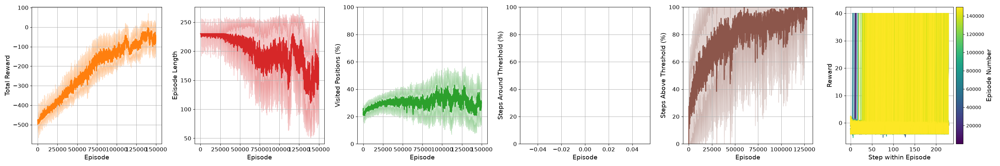

**PPO** (GP off, 460 steps, 10M steps)

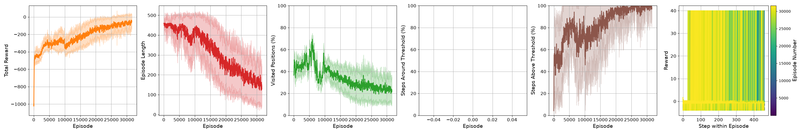

**SAC** (GP off, 460 steps, 10M steps)

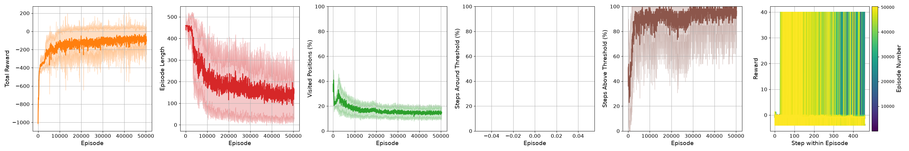

### Observations

- **DQN:** the reward rises slowly and steadily over the whole run, from about −500 to about −50 over 150k episodes. The episode length stays at the 230-step limit for the first ~30k episodes and is still noisy at the end. With `exploration_fraction` 0.8, ε only reaches its final 5 % after 24M of the 30M steps, so most of the run has many random actions.
- **PPO:** the episode length falls from 460 to about 150 and is still falling at the end, so the run had not converged after 10M steps. The share of the map visited falls from about 45 % to about 22 %. It was the fastest run (1.2 h).
- **SAC:** most of the gain happens in the first ~10k episodes. After that, the reward and the episode length level off at about −100 and 150 steps. It visits the smallest share of the map (about 15 %).

## Run 2: `compare` (jobs 4223550, 4223553, 4223557)

- **Goal:** a fair comparison of DQN, PPO and SAC: the same task, training budget and network size for all three, each with its own algorithm settings. Submitted three times with identical settings to see the spread between runs.
- **Submitted with:** `sbatch fox_train.sh compare` (3 times)
- **Code:** `961f7a2` (2026-09-26). PPO used the new `--compare` preset (`COMPARE_CONFIG`).
- **Fox resources per algorithm:** unchanged (16 CPUs, 2 GB per CPU, 16 h limit).

### What changed from run 1

| Change | Commit | Why |
|---|---|---|
| Start in a box around the plume (the plume's bounding box plus 3 cells) instead of anywhere on the map | `ac68318` | In the HRL setup the plume agent takes over near a plume, after the exploration agent has found it. |
| New plume size every episode: σ drawn from [2.0, 5.0] (plumes 5–15 cells wide) instead of a fixed σ = 3.5 | `ac68318` | Train on plumes of different sizes instead of one size. |
| GP on and 230-step episodes for all three (PPO and SAC had the GP off and 460 steps) | `858ee1e` | Same task for all. |
| 10M steps for all (DQN had 30M) | `858ee1e` | Same budget. |
| `gamma` 0.995 for all (was 0.9945 / 0.9975 / 0.997) | `858ee1e` | `gamma` defines what the agent optimizes, so it must be equal. |
| Hidden layers [64, 64] for all (SAC had [256, 256]) | `858ee1e` | Same network size. |
| Checkpoint every 1M steps for all | `858ee1e` | Checkpoints at the same step counts, for evaluation during training. |
| PPO: new `COMPARE_CONFIG` preset with `n_steps` 2048 (was 512 in `PAPER_CONFIG`) | `858ee1e`, `961f7a2` | A PPO preset with the GP on and 230 steps. |
| DQN `exploration_fraction` 0.8 → 0.2 | `cad73a3` | With 0.8, DQN acts mostly at random for most of the run; 0.1–0.3 is standard. |

> Many settings changed at once, so the difference between run 1 and run 2 cannot be traced to a single parameter.

### Task and budget

Values in bold changed from run 1.

| Setting | DQN | PPO | SAC |
|---|---|---|---|
| Script and preset | `train_DDQN.py` | `train_PPO.py` **`--compare`** | `train_SAC.py` |
| GP / `SUB_AGENT_TRAIN_ON_GP` | on / on | **on** / on | **on / on** |
| Episode length (steps) | 230 | **230** | **230** |
| Total steps | **10M** | 10M | 10M |
| Parallel envs | 12 | 12 | 12 |
| `gamma` | **0.995** | **0.995** | **0.995** |
| Hidden layers | [64, 64] ReLU | pi [64, 64], vf [64, 64] Tanh | **[64, 64]** ReLU |
| Checkpoint every | **1M steps** | 1M steps | **1M steps** |
| Start position | **near the plume** | **near the plume** | **near the plume** |
| Plume size | **σ random in [2.0, 5.0]** | **σ random in [2.0, 5.0]** | **σ random in [2.0, 5.0]** |
| Wall-clock time (approx., 3 runs) | 4.2–5.2 h | 2.8–7.4 h | 6.3–11.9 h |

### Algorithm settings

Values in bold changed from run 1.

| Setting | DQN | PPO | SAC |
|---|---|---|---|
| `learning_rate` | 1e-4 | 3e-4 | 5e-5 |
| `batch_size` | 128 | 1024 | 256 |
| Replay buffer | 800,000 | – | 900,000 |
| `learning_starts` | 400,000 | – | 100 (SB3 default) |
| `train_freq` / `gradient_steps` | 4 / 4 | – | 4 / 4 |
| Target network update | every 50,000 steps | – | every step, `tau` 0.01 |
| Exploration | ε from 1.0 to 0.05 over the first **20 %** of the run (`exploration_fraction` **0.2**) | `ent_coef` 0.01 | `ent_coef` auto |
| `n_steps` / `n_epochs` | – | **2048** / 4 | – |
| `gae_lambda` / `clip_range` | – | 0.95 / 0.2 | – |
| `vf_coef` / `max_grad_norm` | – | 0.5 / 0.5 | – |

### Results

Mean ± std over the last 1,000 training episodes of each run:

| Run | Episodes | Total reward | Episode length | Visited (%) | Plume coverage (%) | Ended early (%) |
|---|---|---|---|---|---|---|
| `DQN_compare_4223550` | 55,330 | -94.6 ± 80.0 | 177.8 ± 78.6 | 35.2 ± 17.1 | 93.6 ± 20.6 | 36.9 |
| `DQN_compare_4223553` | 55,211 | -110.1 ± 69.3 | 192.2 ± 67.4 | 29.1 ± 12.0 | 90.0 ± 24.9 | 31.3 |
| `DQN_compare_4223557` | 55,815 | -88.0 ± 75.0 | 171.2 ± 78.0 | 28.7 ± 15.3 | 92.5 ± 22.0 | 44.3 |
| **DQN_compare (mean of 3 runs)** |  | **-97.6 ± 9.2** | **180.4 ± 8.8** | **31.0 ± 3.0** | **92.0 ± 1.5** | **37.5 ± 5.3** |
| `PPO_compare_4223550` | 83,262 | -2.8 ± 49.8 | 77.4 ± 55.1 | 9.0 ± 4.0 | 99.4 ± 5.5 | 96.2 |
| `PPO_compare_4223553` | 83,533 | -6.0 ± 44.9 | 81.5 ± 57.8 | 9.3 ± 3.7 | 99.6 ± 3.4 | 95.5 |
| `PPO_compare_4223557` | 74,930 | -5.4 ± 42.8 | 83.2 ± 58.7 | 10.0 ± 4.5 | 99.5 ± 5.5 | 95.6 |
| **PPO_compare (mean of 3 runs)** |  | **-4.7 ± 1.4** | **80.7 ± 2.4** | **9.4 ± 0.4** | **99.5 ± 0.1** | **95.8 ± 0.3** |
| `SAC_compare_4223550` | 52,335 | -76.0 ± 92.8 | 140.1 ± 84.0 | 9.5 ± 5.5 | 91.5 ± 25.6 | 61.9 |
| `SAC_compare_4223553` | 60,498 | -69.2 ± 110.7 | 117.7 ± 75.9 | 10.9 ± 6.8 | 93.7 ± 22.4 | 80.2 |
| `SAC_compare_4223557` | 51,528 | -85.4 ± 92.9 | 142.0 ± 79.5 | 12.3 ± 8.8 | 92.0 ± 24.2 | 66.7 |
| **SAC_compare (mean of 3 runs)** |  | **-76.9 ± 6.6** | **133.3 ± 11.1** | **10.9 ± 1.2** | **92.4 ± 0.9** | **69.6 ± 7.7** |


**DQN**

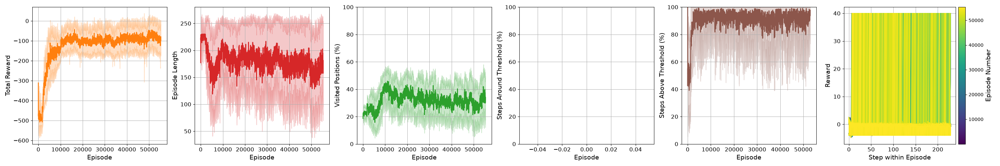
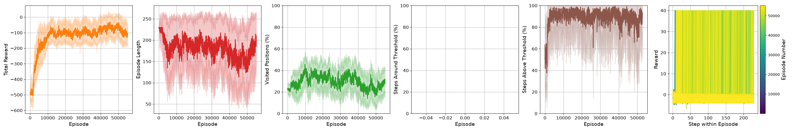
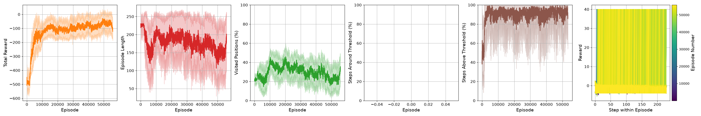

**PPO**

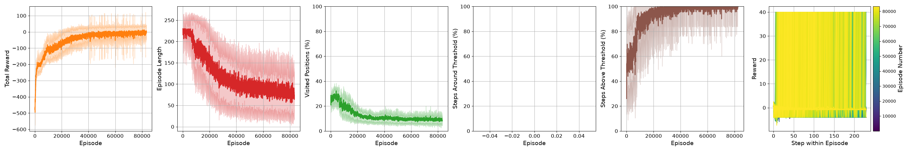
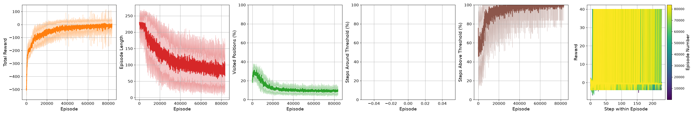
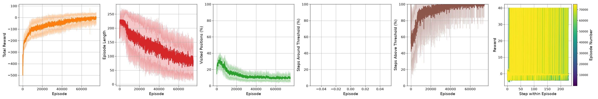

**SAC**

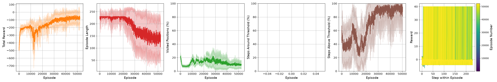
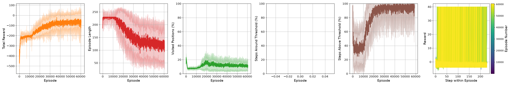
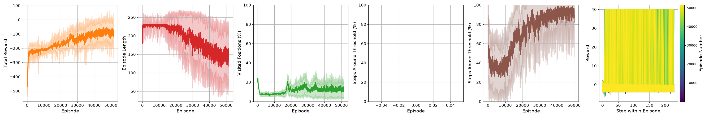

### Observations

- **Spread between repeats:** small for PPO (the run means of the reward range from −6.0 to −2.8), larger for SAC ("ended early" ranges from 62 % to 80 %).
- **DQN:** the reward climbs fast in the first ~10k episodes (ε reaches 0.05 after 2M steps, compared with 24M in run 1), then stays at about −100 for the remaining ~45k episodes. The true plume coverage is high (92 %), but only 37 % of the episodes reach the goal and end early. It visits about 30 % of the map, about 3× more than PPO and SAC.
- **PPO:** the reward rises steadily to about −5. Episodes get shorter (about 80 steps), and 96 % end early with 99.5 % plume coverage while visiting only about 9 % of the map. The reward is still rising slightly and the episode length still falling at 10M steps.
- **SAC:** the episode length stays at the 230-step limit for the first 12k–22k episodes, and the plume coverage drops to 20–40 % during this phase. Then it learns to finish episodes. When this happens differs between repeats (about 12k episodes in `4223553`, about 22k in `4223550`). It ends at about −77 reward, with 70 % of the episodes ending early.
- **Wall-clock time:** SAC took the longest (6.3–11.9 h), then DQN (4.2–5.2 h) and PPO (2.8–7.4 h). The times vary between repeats on the same resources, so treat them as rough.

## Run 3: `compare_100M` (jobs 4259604, 4259607, 4259610)

- **Goal:** the run 2 setup with 10× the training budget, longer episodes and larger networks.
- **Submitted with:** `sbatch fox_train.sh compare_100M` (3 times)
- **Code:** `d80a55e` (2026-10-02).
- **Fox resources per algorithm:** 28 CPUs, 2 GB per CPU (56 GB), 60 h limit.
- **Status:** submitted, results pending.

### What changed from run 2

| Change | Commit |
|---|---|
| 100M steps for all (was 10M) | `4a452da` |
| 24 parallel envs (was 12) | `4a452da` |
| 460-step episodes for all (was 230) | `4a452da` |
| Hidden layers [128, 128] for all (was [64, 64]) | `4a452da` |
| Checkpoint every 10M steps (was 1M) | `4a452da` |
| Fox: 28 CPUs, 56 GB, 60 h (was 16 CPUs, 32 GB, 16 h) | `d80a55e` |

### Task and budget

Values in bold changed from run 2. The algorithm settings are unchanged from run 2.

| Setting | DQN | PPO | SAC |
|---|---|---|---|
| Script and preset | `train_DDQN.py` | `train_PPO.py --compare` | `train_SAC.py` |
| GP / `SUB_AGENT_TRAIN_ON_GP` | on / on | on / on | on / on |
| Episode length (steps) | **460** | **460** | **460** |
| Total steps | **100M** | **100M** | **100M** |
| Parallel envs | **24** | **24** | **24** |
| `gamma` | 0.995 | 0.995 | 0.995 |
| Hidden layers | **[128, 128]** ReLU | **pi [128, 128], vf [128, 128]** Tanh | **[128, 128]** ReLU |
| Checkpoint every | **10M steps** | **10M steps** | **10M steps** |
| Start position | near the plume | near the plume | near the plume |
| Plume size | σ random in [2.0, 5.0] | σ random in [2.0, 5.0] | σ random in [2.0, 5.0] |

### Points to keep in mind when reading the results

- Several settings changed at once, so the difference from run 2 cannot be traced to a single parameter.
- `gamma` stays 0.995, which looks about 200 steps ahead (1 / (1 − 0.995)), while episodes can now last 460 steps.
- DQN's `exploration_fraction` stays 0.2, which now means 20M steps of decreasing exploration (2M in run 2). `learning_starts` (400,000) and the replay buffers (DQN 800,000, SAC 900,000) are unchanged, so they are a smaller share of the run.
- PPO now collects `n_steps` 2048 × 24 envs = 49,152 steps per update (24,576 in run 2).
- In run 2, SAC needed up to 12 h for 10M steps. If a run hits the 60 h limit, the last 10M-step checkpoint is kept.
- Commit `10e4023` (2026-10-04) keeps only the newest `episode_stats_*.pkl` snapshot. It only applies to these jobs if they started after that commit was pulled on Fox.

### To fill in when the runs are downloaded

- Start time (`RUN_INFO.timestamp` in `training_config.json`) and wall-clock time.
- Copy `training_stats.png` and `training_config.json` to `training_runs/<run>/`.
- Numbers table, plots and observations.

## Adding a new run

1. Before submitting: commit the changes and note the commit. Submit with `sbatch fox_train.sh <tag>` and note the job ID(s).
2. Add a row to the overview table and a section with the goal, what changed (with commits and why), the settings tables and the Fox resources.
3. After downloading: make the plot with [training_data_visualiser.py](../HUGIN_gym/evaluation/training_data_visualiser.py). Copy `training_stats.png` and `training_config.json` to `docs/training_runs/<run>/`. Run [summarise_training_stats.py](../HUGIN_gym/evaluation/summarise_training_stats.py) for the numbers table.
4. Write down what the curves and the numbers show.
